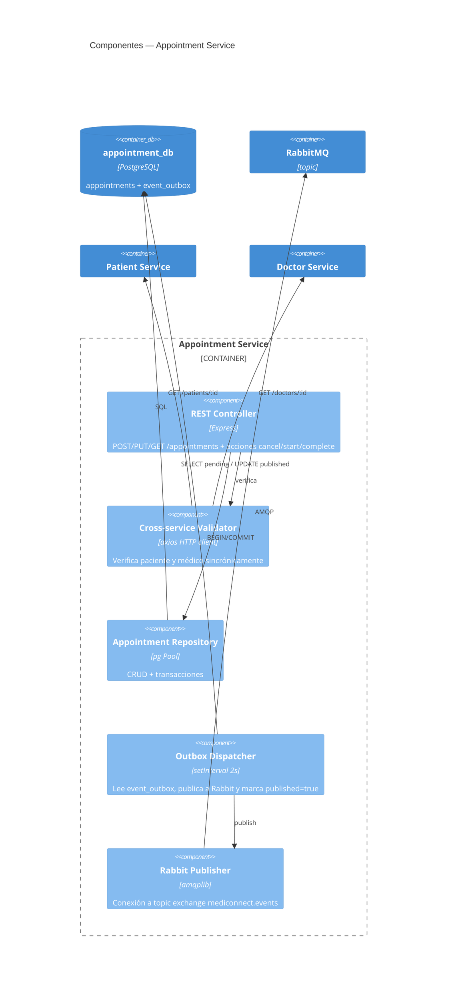

# C4 — Nivel 3: Componentes (Appointment Service)

```mermaid
C4Component
    title Componentes — Appointment Service

    Container_Boundary(appt, "Appointment Service") {
        Component(api, "REST Controller", "Express", "POST/PUT/GET /appointments + acciones cancel/start/complete")
        Component(validator, "Cross-service Validator", "axios HTTP client", "Verifica paciente y médico sincrónicamente")
        Component(repo, "Appointment Repository", "pg Pool", "CRUD + transacciones")
        Component(outbox, "Outbox Dispatcher", "setInterval 2s", "Lee event_outbox, publica a Rabbit y marca published=true")
        Component(rabbit, "Rabbit Publisher", "amqplib", "Conexión a topic exchange mediconnect.events")
    }
    ContainerDb(db, "appointment_db", "PostgreSQL", "appointments + event_outbox")
    Container(broker, "RabbitMQ", "topic")
    Container(patient, "Patient Service")
    Container(doctor, "Doctor Service")

    Rel(api, validator, "verifica")
    Rel(validator, patient, "GET /patients/:id")
    Rel(validator, doctor, "GET /doctors/:id")
    Rel(api, repo, "BEGIN/COMMIT")
    Rel(repo, db, "SQL")
    Rel(outbox, db, "SELECT pending / UPDATE published")
    Rel(outbox, rabbit, "publish")
    Rel(rabbit, broker, "AMQP")
```
