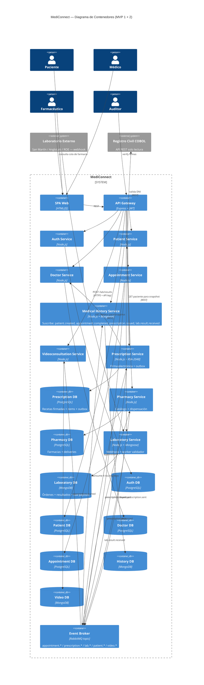

# C4 — Nivel 2: Contenedores (con MVP 2)

```mermaid
C4Container
    title MediConnect — Diagrama de Contenedores (MVP 1 + 2)

    Person(paciente, "Paciente")
    Person(medico, "Médico")
    Person(farmaceutico, "Farmacéutico")
    Person(auditor, "Auditor")
    System_Ext(labExt, "Laboratorio Externo", "San Martín / AngloLab / ROE — webhook")
    System_Ext(cobol, "Registro Civil COBOL", "API REST solo lectura")

    System_Boundary(mc, "MediConnect") {
        Container(spa, "SPA Web", "HTML/JS")
        Container(gw, "API Gateway", "Express + JWT")

        Container(auth, "Auth Service", "Node.js")
        Container(patient, "Patient Service", "Node.js")
        Container(doctor, "Doctor Service", "Node.js")
        Container(appt, "Appointment Service", "Node.js")
        Container(history, "Medical History Service", "Node.js + Mongoose", "Suscribe: patient.created, appointment.completed, prescription.issued, lab.result.received")
        Container(video, "Videoconsultation Service", "Node.js")

        Container(rx, "Prescription Service", "Node.js + RSA-2048", "Firma electrónica + outbox")
        ContainerDb(rxdb, "Prescription DB", "PostgreSQL", "Recetas firmadas + items + outbox")

        Container(pharm, "Pharmacy Service", "Node.js", "Catálogo + dispensación")
        ContainerDb(pharmdb, "Pharmacy DB", "PostgreSQL", "Farmacias + deliveries")

        Container(lab, "Laboratory Service", "Node.js + Mongoose", "Webhook + worker validador")
        ContainerDb(labdb, "Laboratory DB", "MongoDB", "Órdenes + resultados + raw payload")

        ContainerDb(authdb, "Auth DB", "PostgreSQL")
        ContainerDb(patientdb, "Patient DB", "PostgreSQL")
        ContainerDb(doctordb, "Doctor DB", "PostgreSQL")
        ContainerDb(apptdb, "Appointment DB", "PostgreSQL")
        ContainerDb(historydb, "History DB", "MongoDB")
        ContainerDb(videodb, "Video DB", "MongoDB")

        Container(broker, "Event Broker", "RabbitMQ topic", "appointment.* / prescription.* / lab.* / patient.* / video.*")
    }

    Rel(paciente, spa, "")
    Rel(medico, spa, "")
    Rel(farmaceutico, spa, "consulta cola de farmacia")
    Rel(auditor, gw, "verify firmas")
    Rel(spa, gw, "REST")

    Rel(gw, auth, "")
    Rel(gw, patient, "")
    Rel(gw, doctor, "")
    Rel(gw, appt, "")
    Rel(gw, history, "")
    Rel(gw, video, "")
    Rel(gw, rx, "")
    Rel(gw, pharm, "")
    Rel(gw, lab, "")

    Rel(labExt, lab, "POST /lab/results", "HTTPS + API key")
    Rel(patient, cobol, "valida DNI", "REST")

    Rel(rx, patient, "GET paciente para snapshot", "REST")
    Rel(rx, doctor, "GET médico para snapshot", "REST")

    Rel(auth, authdb, "")
    Rel(patient, patientdb, "")
    Rel(doctor, doctordb, "")
    Rel(appt, apptdb, "")
    Rel(history, historydb, "")
    Rel(video, videodb, "")
    Rel(rx, rxdb, "")
    Rel(pharm, pharmdb, "")
    Rel(lab, labdb, "")

    Rel(appt, broker, "appointment.*")
    Rel(rx, broker, "prescription.issued, prescription.sent")
    Rel(pharm, broker, "prescription.dispensed")
    Rel(lab, broker, "lab.result.received")
    Rel(broker, history, "consume 4 routing keys")
    Rel(broker, pharm, "prescription.sent")
    Rel(broker, rx, "prescription.dispensed")
    Rel(broker, video, "appointment.started")
```
