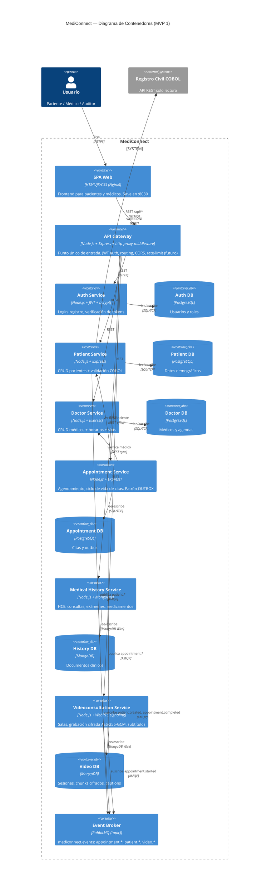

# C4 — Nivel 2: Contenedores

```mermaid
C4Container
    title MediConnect — Diagrama de Contenedores (MVP 1)

    Person(user, "Usuario", "Paciente / Médico / Auditor")

    System_Boundary(mc, "MediConnect") {
        Container(spa, "SPA Web", "HTML/JS/CSS (Nginx)", "Frontend para pacientes y médicos. Sirve en :8080")
        Container(gw, "API Gateway", "Node.js + Express + http-proxy-middleware", "Punto único de entrada. JWT auth, routing, CORS, rate-limit (futuro)")

        Container(auth, "Auth Service", "Node.js + JWT + bcrypt", "Login, registro, verificación de tokens")
        ContainerDb(authdb, "Auth DB", "PostgreSQL", "Usuarios y roles")

        Container(patient, "Patient Service", "Node.js + Express", "CRUD pacientes + validación COBOL")
        ContainerDb(patientdb, "Patient DB", "PostgreSQL", "Datos demográficos")

        Container(doctor, "Doctor Service", "Node.js + Express", "CRUD médicos + horarios + slots")
        ContainerDb(doctordb, "Doctor DB", "PostgreSQL", "Médicos y agendas")

        Container(appt, "Appointment Service", "Node.js + Express", "Agendamiento, ciclo de vida de citas. Patrón OUTBOX")
        ContainerDb(apptdb, "Appointment DB", "PostgreSQL", "Citas y outbox")

        Container(history, "Medical History Service", "Node.js + Mongoose", "HCE: consultas, exámenes, medicamentos")
        ContainerDb(historydb, "History DB", "MongoDB", "Documentos clínicos")

        Container(video, "Videoconsultation Service", "Node.js + WebRTC signaling", "Salas, grabación cifrada AES-256-GCM, subtítulos")
        ContainerDb(videodb, "Video DB", "MongoDB", "Sesiones, chunks cifrados, captions")

        Container(broker, "Event Broker", "RabbitMQ (topic)", "mediconnect.events: appointment.*, patient.*, video.*")
    }

    System_Ext(cobol, "Registro Civil COBOL", "API REST solo lectura")

    Rel(user, spa, "Usa", "HTTPS")
    Rel(spa, gw, "REST /api/*", "HTTPS")

    Rel(gw, auth, "REST", "HTTP")
    Rel(gw, patient, "REST")
    Rel(gw, doctor, "REST")
    Rel(gw, appt, "REST")
    Rel(gw, history, "REST")
    Rel(gw, video, "REST")

    Rel(auth, authdb, "lee/escribe", "SQL/TCP")
    Rel(patient, patientdb, "lee/escribe", "SQL/TCP")
    Rel(patient, cobol, "valida DNI", "REST")
    Rel(doctor, doctordb, "lee/escribe", "SQL/TCP")
    Rel(appt, apptdb, "lee/escribe", "SQL/TCP")
    Rel(appt, patient, "verifica paciente", "REST sync")
    Rel(appt, doctor, "verifica médico", "REST sync")
    Rel(history, historydb, "lee/escribe", "MongoDB Wire")
    Rel(video, videodb, "lee/escribe", "MongoDB Wire")

    Rel(appt, broker, "publica appointment.*", "AMQP")
    Rel(patient, broker, "publica patient.*", "AMQP")
    Rel(video, broker, "publica video.*", "AMQP")
    Rel(history, broker, "suscribe patient.created, appointment.completed", "AMQP")
    Rel(video, broker, "suscribe appointment.started", "AMQP")
```
