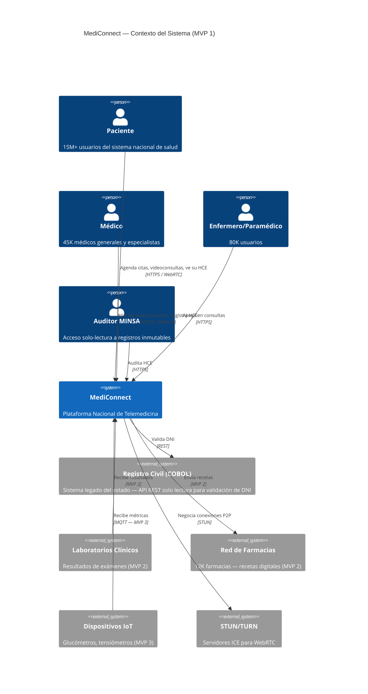

# C4 — Nivel 1: Contexto

```mermaid
C4Context
    title MediConnect — Contexto del Sistema (MVP 1)

    Person(paciente, "Paciente", "15M+ usuarios del sistema nacional de salud")
    Person(medico, "Médico", "45K médicos generales y especialistas")
    Person(enfermero, "Enfermero/Paramédico", "80K usuarios")
    Person(auditor, "Auditor MINSA", "Acceso solo-lectura a registros inmutables")

    System(mediconnect, "MediConnect", "Plataforma Nacional de Telemedicina")

    System_Ext(cobol, "Registro Civil (COBOL)", "Sistema legado del estado — API REST solo lectura para validación de DNI")
    System_Ext(lab, "Laboratorios Clínicos", "Resultados de exámenes (MVP 2)")
    System_Ext(farmacia, "Red de Farmacias", "12K farmacias — recetas digitales (MVP 2)")
    System_Ext(iot, "Dispositivos IoT", "Glucómetros, tensiómetros (MVP 3)")
    System_Ext(stun, "STUN/TURN", "Servidores ICE para WebRTC")

    Rel(paciente, mediconnect, "Agenda citas, videoconsultas, ve su HCE", "HTTPS / WebRTC")
    Rel(medico, mediconnect, "Atiende videoconsultas, registra HCE", "HTTPS / WebRTC")
    Rel(enfermero, mediconnect, "Apoya en consultas", "HTTPS")
    Rel(auditor, mediconnect, "Audita HCE", "HTTPS")

    Rel(mediconnect, cobol, "Valida DNI", "REST")
    Rel(mediconnect, stun, "Negocia conexiones P2P", "STUN")
    Rel_Back(mediconnect, lab, "Recibe resultados", "MVP 2")
    Rel(mediconnect, farmacia, "Envía recetas", "MVP 2")
    Rel_Back(mediconnect, iot, "Recibe métricas", "MQTT — MVP 3")
```
