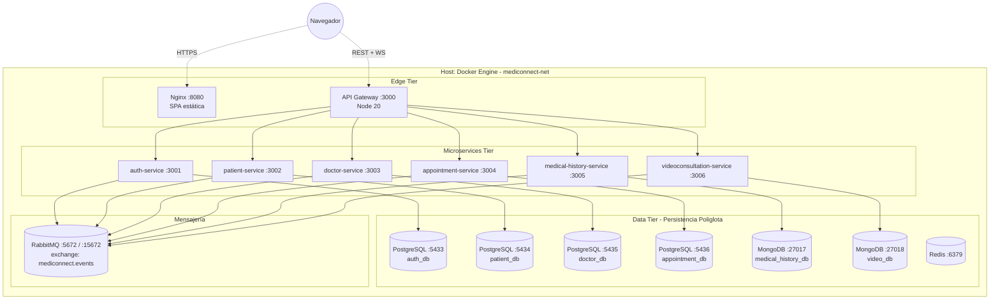
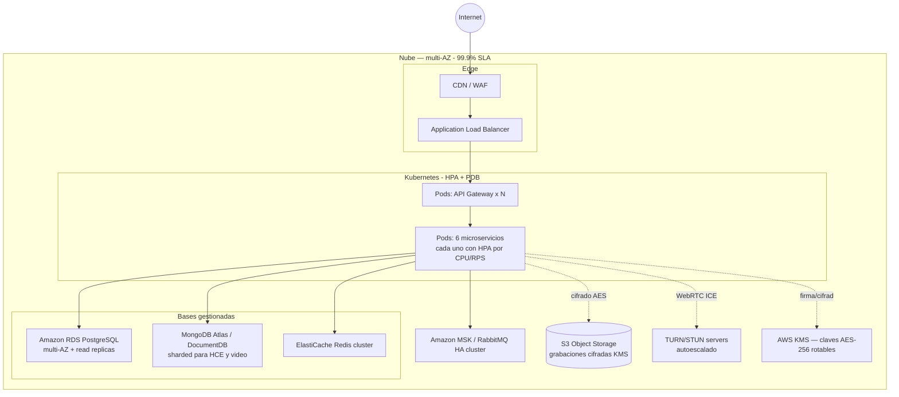

# Diagrama de Despliegue

## Despliegue local (Hackaton — Docker Compose)

## Despliegue objetivo en producción (referencia)

### Decisiones de despliegue clave

- **Microservicios stateless** → escalado horizontal con HPA.
- **Read replicas en PostgreSQL** para reducir presión del dashboard clínico (<150ms).
- **MongoDB sharded** para crecimiento ilimitado del HCE (15M pacientes).
- **Almacenamiento de grabaciones en S3** con cifrado en reposo via KMS (no en MongoDB).
- **RabbitMQ HA / MSK** garantiza la entrega de eventos críticos.
- **Modo degradado offline-first** (PWA con IndexedDB) para zonas rurales — pendiente como evolución del frontend.
