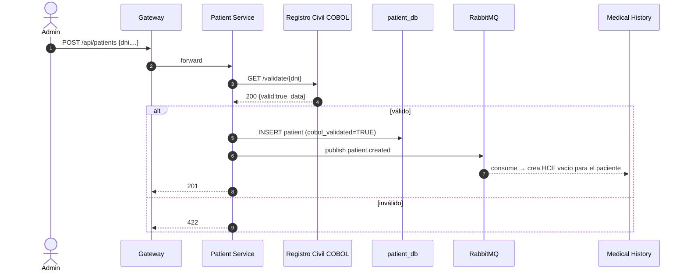

# Diagramas de Secuencia — MVP 1

## 1. Agendar cita

```mermaid
sequenceDiagram
    autonumber
    actor P as Paciente
    participant W as Frontend SPA
    participant GW as API Gateway
    participant AU as Auth
    participant AP as Appointment
    participant PA as Patient
    participant DO as Doctor
    participant DB as appointment_db
    participant R as RabbitMQ

    P->>W: Click "Agendar"
    W->>GW: POST /api/appointments (JWT)
    GW->>AU: verify JWT (local middleware)
    GW->>AP: POST /appointments
    par Validación cross-service
        AP->>PA: GET /patients/{id}
        PA-->>AP: 200 OK
    and
        AP->>DO: GET /doctors/{id}
        DO-->>AP: 200 OK (specialty, name)
    end
    AP->>DB: BEGIN; INSERT appointments; INSERT event_outbox; COMMIT
    AP-->>GW: 201 Created
    GW-->>W: 201 + JSON cita
    W-->>P: "Cita agendada ✓"
    Note over AP,R: Outbox Dispatcher (asíncrono, cada 2s)
    AP->>R: publish appointment.created (topic)
```

## 2. Videoconsulta con HCE y grabación cifrada

```mermaid
sequenceDiagram
    autonumber
    actor M as Médico
    actor P as Paciente
    participant W as Frontend
    participant GW as API Gateway
    participant AP as Appointment
    participant V as Video Service
    participant H as Medical History
    participant MQ as RabbitMQ
    participant MDB as video_db (MongoDB)

    M->>W: Click "Iniciar Video"
    W->>GW: POST /api/appointments/{id}/start
    GW->>AP: forward
    AP->>AP: UPDATE status=EN_CURSO; INSERT outbox(appointment.started)
    AP-->>W: 200
    Note over AP,MQ: dispatcher publica appointment.started
    AP->>MQ: appointment.started
    MQ-->>V: consume
    V->>MDB: crea Session (roomId, webrtcConfig)

    W->>GW: POST /api/sessions/{room}/start
    GW->>V: forward
    V->>MDB: status=ACTIVE, recording.isRecording=true
    V-->>W: 200

    W->>GW: GET /api/history/{patientId}
    GW->>H: forward
    H-->>W: HCE completo (consultas, exámenes, meds) [<150ms]
    W-->>M: muestra panel HCE lateral

    par Stream WebRTC (P2P vía STUN)
        P-->>M: video/audio
        M-->>P: video/audio
    and Subtítulos accesibilidad
        loop cada caption generado
            W->>GW: POST /api/sessions/{room}/captions
            GW->>V: append caption
        end
    and Grabación cifrada
        loop cada chunk
            W->>GW: POST /api/sessions/{room}/recording/chunk
            GW->>V: forward
            V->>V: AES-256-GCM encrypt (iv, tag)
            V->>MDB: push chunk cifrado
        end
    end

    M->>W: "Finalizar consulta"
    W->>GW: POST /api/sessions/{room}/end
    GW->>V: forward
    V->>MDB: status=ENDED, durationSeconds
    V->>MQ: video.session.ended

    W->>GW: POST /api/appointments/{id}/complete (notas)
    GW->>AP: forward
    AP->>AP: UPDATE status=COMPLETADA; INSERT outbox(appointment.completed)
    AP->>MQ: appointment.completed
    MQ-->>H: consume → registra consulta en HCE
```

## 3. Validación COBOL al crear paciente


