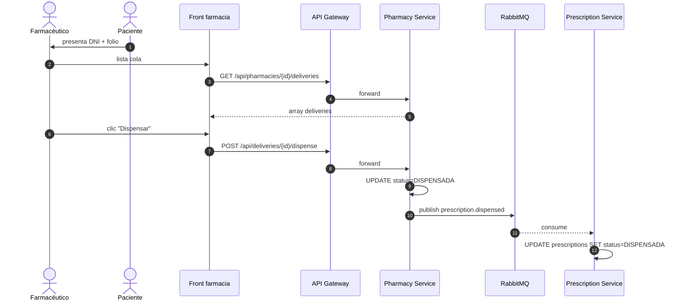
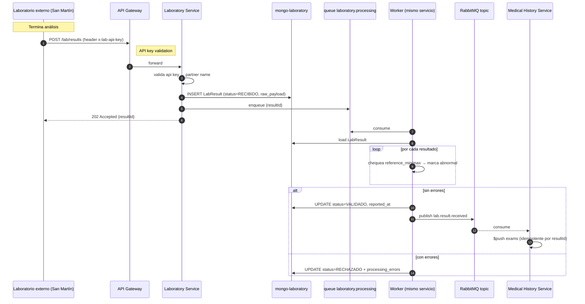
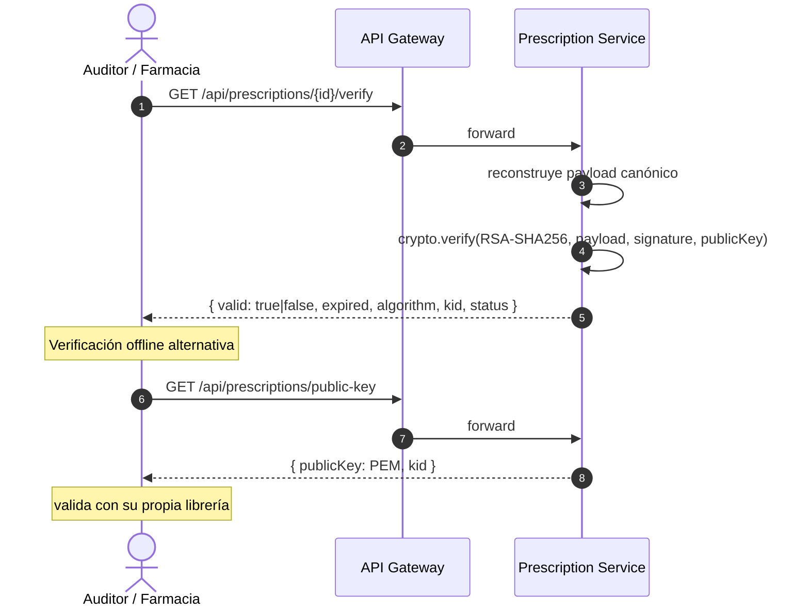

# Diagramas de Secuencia — MVP 2

## 1. Emisión de receta digital firmada y envío a farmacia

```mermaid
sequenceDiagram
    autonumber
    actor M as Médico
    participant W as Frontend
    participant GW as API Gateway
    participant RX as Prescription Service
    participant PA as Patient Service
    participant DO as Doctor Service
    participant DB as prescription_db
    participant R as RabbitMQ
    participant PH as Pharmacy Service
    participant HCE as Medical History
    participant PHDB as pharmacy_db

    M->>W: "Firmar y emitir" (durante video)
    W->>GW: POST /api/prescriptions
    GW->>RX: forward
    par Snapshot canónico
        RX->>PA: GET /patients/{id}
        PA-->>RX: datos
    and
        RX->>DO: GET /doctors/{id}
        DO-->>RX: datos
    end
    RX->>RX: canonicalize(payload) + RSA-SHA256 sign
    RX->>DB: BEGIN; INSERT prescriptions + items + outbox(prescription.issued, prescription.sent); COMMIT
    RX-->>W: 201 receta firmada (folio + signature + kid)
    
    Note over RX,R: Outbox dispatcher (cada 2s)
    RX->>R: publish prescription.issued
    RX->>R: publish prescription.sent
    
    R-->>HCE: consume prescription.issued
    HCE->>HCE: $push medicamentos (idempotente)
    
    R-->>PH: consume prescription.sent
    PH->>PHDB: INSERT delivery (status=RECIBIDA)
```

## 2. Dispensación en farmacia



## 3. Recepción asíncrona de resultados de laboratorio



## 4. Verificación de firma de receta (auditor / farmacia escéptica)


