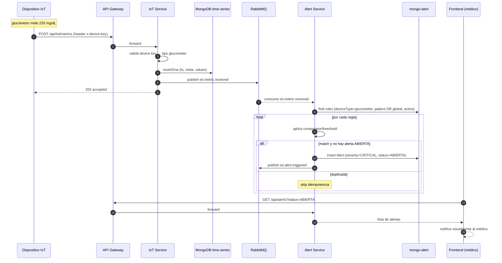
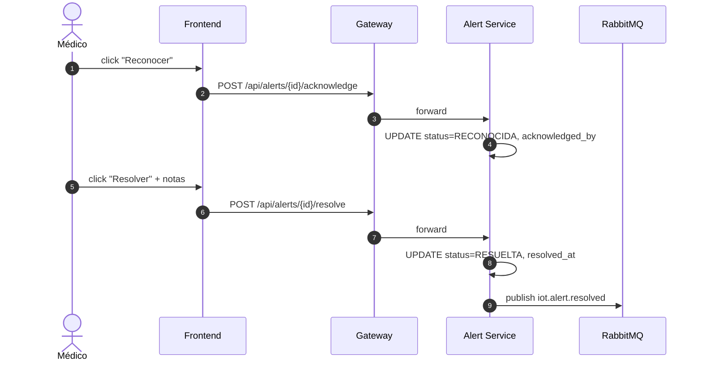
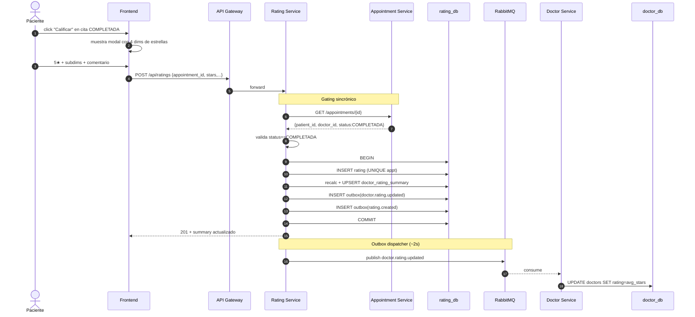
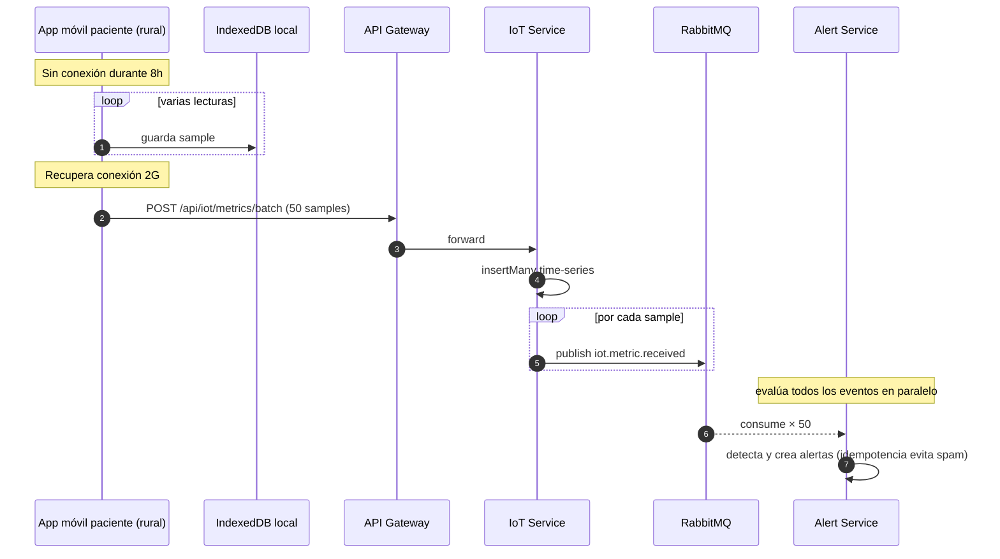

# Diagramas de Secuencia — MVP 3

## 1. Métrica IoT → Alerta automática al médico

## 2. Médico reconoce/resuelve alerta

## 3. Calificación post-consulta con proyección al doctor

## 4. Ingesta batch desde zona rural (offline-first)

