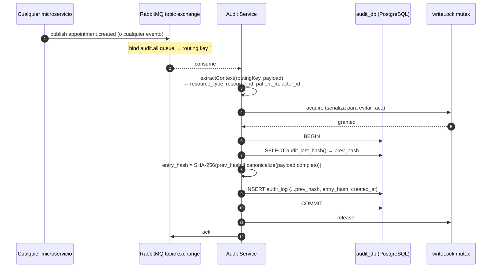
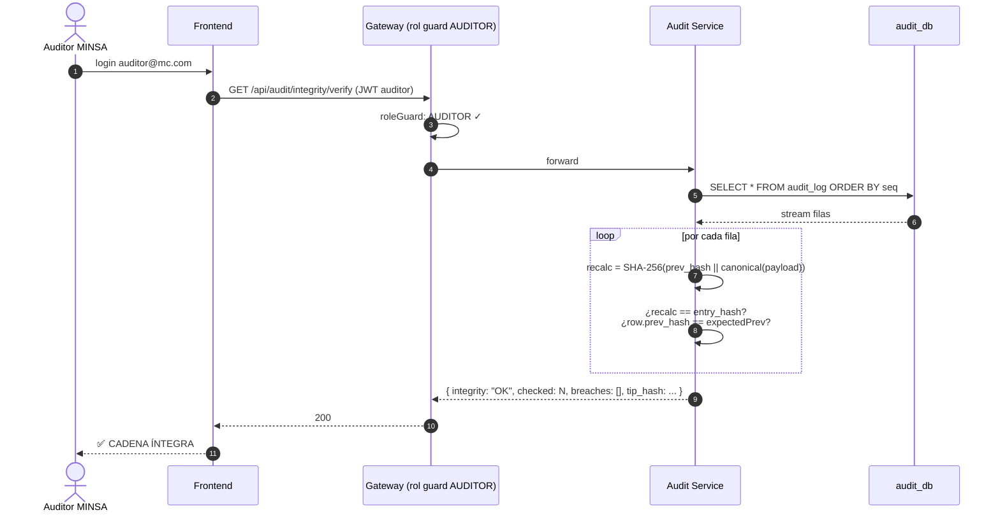
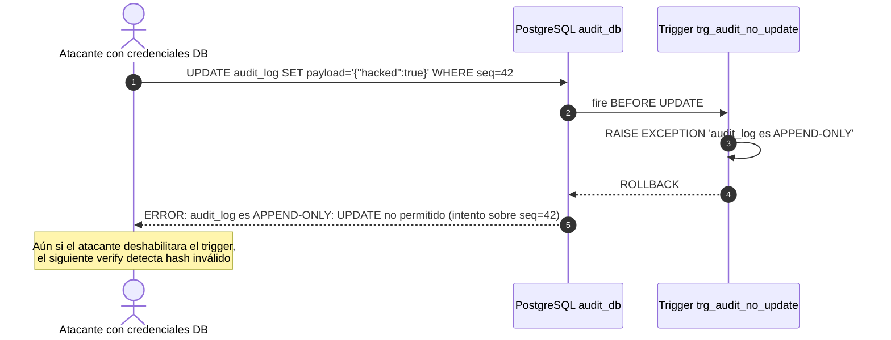
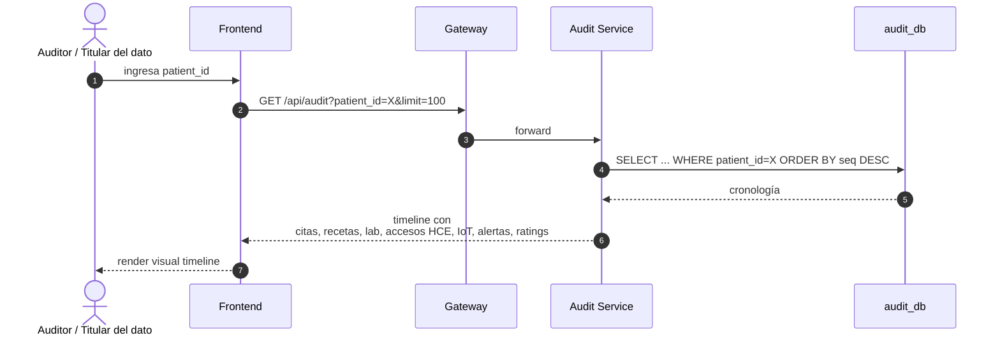
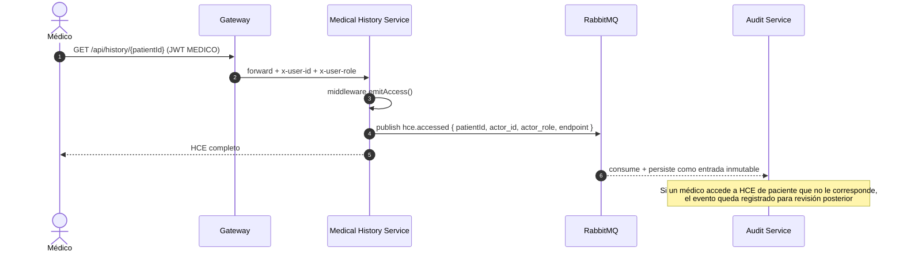

# Diagramas de Secuencia — MVP 4

## 1. Captura universal de evento → cadena criptográfica

## 2. Verificación de integridad por el auditor

## 3. Intento de tampering: trigger PostgreSQL bloquea

## 4. Auditoría completa por paciente (timeline GDPR)

## 5. Acceso a HCE deja huella

